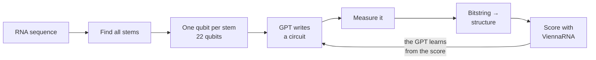

# Teaching a GPT to Write Quantum Circuits for RNA Folding

**WISER Summer Program 2026 — Moderna Challenge**
*Optimization of mRNA Secondary Structure Prediction Using Quantum Computing*

We take the **Generative Quantum Eigensolver (GQE)**, built for molecules, and apply it to RNA folding. A small GPT learns to write quantum circuits. When we measure those circuits, the answers are low-energy RNA structures. We check every result against ViennaRNA.

📹 **Video walkthrough:** *(add your link here)*

---

## The problem in one picture

An RNA molecule folds back on itself. A and U pair up, C and G pair up. The set of pairs it forms is its **structure**. Nature picks the structure with the lowest energy.

```
Sequence:  GGAGCAAAACUUGUCGAUUGAGAACAAAAUACAGAAUUUGCUUG
Structure: .(((((((..((((...(((....)))...))))..))))))).
Energy:    -7.90 kcal/mol
```

`(` and `)` mark a pair. `.` marks a free base.

---

## How our method works

We do not put one qubit per base pair — that needs over 100 qubits. Instead we put **one qubit per stem**. A stem is a run of pairs, like a zipper. Real structures use only a handful of stems, so this cuts the qubit count by about five times.



Qubit *k* set to 1 means "use stem *k*". The energy of a bitstring is the sum of its stem energies plus a penalty when two stems clash.

---

## Two ways to train

This was our main experiment, and the difference is large.

| | **Offline** | **Online** |
|---|---|---|
| Circuits come from | rolling dice | the model itself |
| Dataset | 512 circuits, frozen | rolling window, refreshed each epoch |
| Model shapes its own data | no | yes |
| Best circuits reach the optimum | **0%** | **100%** |

Offline training got much better at *predicting* energies — the loss fell from 1707 to 319. But the circuits it wrote never improved. It only ever sees random circuits, and random circuits almost never visit the good part of the landscape.

Online training closed the loop: the model writes circuits, we score them, and those scores become its next lesson. That is what made it work.

---

## Results

**44-base test sequence, 22 qubits, 4096 shots per circuit**

| Method | Structure energy | Gap to best | F1 |
|---|---|---|---|
| ViennaRNA (target) | **−7.90** | 0.00 | 1.00 |
| Brute force (exact QUBO) | −7.00 | 0.90 | 0.79 |
| **GQE (ours)** | **−7.00** | **0.90** | **0.79** |
| Simulated annealing | −7.00 | 0.90 | 0.79 |
| Greedy | −3.70 | 4.20 | 0.67 |
| Classical GPT (no quantum) | *did not find a valid structure* | | |
| Random search | *did not find a valid structure* | | |

**GQE matched the exact QUBO optimum.** It also beat the classical GPT ablation — same model, same budget, the only difference being whether a quantum circuit sits in between.

The 0.90 gap is not a search failure. It is the **encoding error**: our QUBO holds pair interactions only, so it cannot capture how three stems interact at once. Every method in the table inherits the same gap.

---

## What is in this repo

| Notebook | What it does | Time |
|---|---|---|
| `01_setup_and_classical` | ViennaRNA reference answers | 1 min |
| `02_encoding_and_qubo` | RNA → stems → qubits → QUBO | 1 min |
| `03_gqe_training` | **The main experiment** | 20 min |
| `04_baselines_and_metrics` | Is the quantum part helping? | 5 min |
| `05_scaling_and_extras` | Qubit scaling, pseudoknots, noise | 3 min |
| `06_full_27_qubit_run` | The largest instance we can simulate | 45 min |

`src/` holds the code: RNA encoding, a fast statevector simulator, the GPT, and the training loops.

---

## How to run it

1. Upload **`gqe-rna.zip`** to the top level of your Google Drive. Do not unzip it.
2. Open [Google Colab](https://colab.research.google.com) → **File → Upload notebook**.
3. **Runtime → Change runtime type → T4 GPU** (the free tier is enough).
4. **Run all.** Start with notebook 01 and go in order.

Results are saved to your Drive, so each notebook picks up where the last one stopped.

---

## What we learned

**The encoding matters more than the optimizer.** We found and fixed three separate sources of error before the search ever mattered: stem energies do not simply add up, the right helix can be filtered out before you start, and the energy scale has to be clipped or the circuit cannot tell good structures apart.

**Online training is what makes GQE work.** Offline alone predicts well and searches not at all.

**We do not claim a quantum speedup.** Classical dynamic programming solves this exact problem in O(L³). We chose it because we know the right answer, so we can check whether the quantum formulation is correct.

---

## Limits

- Our QUBO models stem energies and clashes. It does not model loop entropy, bulges, or dangling ends. This costs 0.90 kcal/mol on our test sequence.
- We simulate up to 27 qubits on a free T4. One statevector is 1.07 GB, so this is a memory wall.
- The Hamiltonian is diagonal, so the answer is a plain bitstring, not an entangled state. Classical heuristics stay competitive.
- The method needs energy errors under about 5% of the energy spread. Above that the ranking of good structures breaks down.

## Where this would be worth doing

- **Pseudoknots** — crossing stems. Classical dynamic programming cannot handle them. In our QUBO it is a single flag.
- **Multi-objective mRNA design** — folding energy plus codon usage, GC content, uridine depletion. Extra goals break the classical recursion but are just more QUBO terms for us.

---

## Team

| Name | Email |
|---|---|
| *(your name)* | *(your email)* |
| | |
| | |

## Credits

- Nakaji et al., *The generative quantum eigensolver (GQE)*, [arXiv:2401.09253](https://arxiv.org/abs/2401.09253)
- [PennyLane GQE demo](https://pennylane.ai/demos/gqe_training)
- Fox et al., *RNA folding using quantum computers*, PLOS Comput Biol 2022 — the stem-per-qubit encoding
- Egger et al., *Warm-starting quantum optimization* — our initial state
- [ViennaRNA](https://www.tbi.univie.ac.at/RNA/) — every energy in this repo

Only random and public RNA sequences were used. No Moderna, patient, clinical, or proprietary data.
