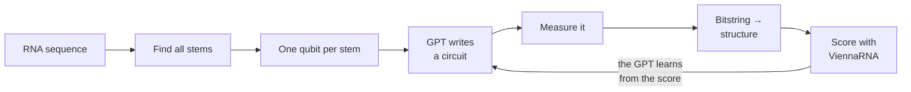

# Enhancing VQE/QAOA Scalability Using a GPT

**WISER Summer Program 2026 — Moderna Challenge**
*Optimization of mRNA Secondary Structure Prediction Using Quantum Computing*

Most quantum approaches to RNA folding put trainable parameters **inside** the circuit. That is why gate-model results in this area stall at a handful of qubits: the gradients have to be estimated on the quantum device, and they vanish as circuits grow.

We took a different route. Our circuit has **no trainable parameters at all**. A small GPT learns which circuits to write, so the optimisation never happens on the quantum device. Measuring those circuits gives low-energy RNA structures, and we check every result against ViennaRNA.

📹 **Video walkthrough:** https://www.loom.com/share/457a0863654a4be384f9e80e6f63661b

---

## The problem in one picture

An RNA molecule folds back on itself. A pairs with U, C pairs with G. The set of pairs it forms is its **structure**. Nature picks the structure with the lowest energy.

```
Sequence:  GGAGCAAAACUUGUCGAUUGAGAACAAAAUACAGAAUUUGCUUG
Structure: .(((((((..((((...(((....)))...))))..))))))).
Energy:    -7.90 kcal/mol
```

`(` and `)` mark a pair. `.` marks a free base. This is the 44-base example sequence from the challenge brief, and it is the instance we solved exactly.

---

## How our method works

We do not put one qubit per base pair — that needs over 100 qubits. Instead we put **one qubit per stem**. A stem is a run of pairs, like a zipper. Real structures use only a handful of stems, so this cuts the qubit count by about five times.



Qubit *k* set to 1 means "use stem *k*". The energy of a bitstring is the sum of its stem energies plus a penalty when two stems clash.

---

## Two ways to train

This was our main experiment, and the difference is large.

| | **Offline** | **Online** |
|---|---|---|
| Circuits come from | rolling dice | the model itself |
| Dataset | 512 circuits, frozen | rolling window, refreshed each epoch |
| Model shapes its own data | no | yes |
| Circuits reaching the optimum | **0–1.6%** | **100%** |

Offline training got much better at *predicting* energies — the loss fell from 1707 to 319. But the circuits it wrote never improved. It only ever sees random circuits, and random circuits almost never visit the good part of the landscape.

Online training closed the loop: the model writes circuits, we score them, and those scores become its next lesson. That is what made it work.

---

## Main result — the challenge sequence

**44 bases, 27 qubits (every stem kept), 32768 shots**

| Method | Structure energy | Gap | F1 |
|---|---|---|---|
| ViennaRNA (target) | **−7.90** | 0.00 | 1.00 |
| Brute force (exact QUBO) | −7.90 | 0.00 | 1.00 |
| **GQE (ours), 27 qubits** | **−7.90** | **0.00** | **1.00** |
| GQE (ours), 22 qubits | −7.00 | 0.90 | 0.79 |
| Simulated annealing | −7.90 | 0.00 | 1.00 |
| Classical GPT (no quantum) | *no valid structure found* | | |
| Random search | *no valid structure found* | | |

With all 27 stems kept, GQE recovered the **exact** ViennaRNA minimum free energy structure. At 22 qubits some stems are dropped to save memory, and one helix the correct answer needs goes with them — hence the 0.90 gap.

The classical GPT row is the control that isolates the quantum contribution: the same model, the same training budget, the only difference being whether a quantum circuit sits between the model and the answer. It never found a valid structure.

---

## Benchmark across five sequences

To show the method is not tuned to one example, we ran the full pipeline on five sequences at two different minimum stem lengths. All ten runs are independent — fresh model, fresh simulator, fresh seed.

### Table 1 — what the encoding costs

| | Length | Sequence |
|---|---|---|
| **S1** | 24 nt | `CUGCGGCGGGCAGCUGUGCUGCGU` |
| **S2** | 30 nt | `AUCGAUGACAUGUGCCUGGUACUUCGGCAG` |
| **S3** | 36 nt | `UUCAGCAAUGGAUGUGCGUAUGCCUCGGAAACGCGU` |
| **S4** | 44 nt | `AGGAACAACGUGGUACGGCGCAGGUGUCCAGUACUAGACAAAUG` |
| **S5** | 50 nt | `GUUUCGGUGAACACCCAACUGAAGCGACAUGUUCGGCUCUUCACCCAUCU` |

| Sequence | Length | Qubits (min stem 3) | Qubits (min stem 4) | ViennaRNA MFE | ViennaRNA time |
|---|---|---|---|---|---|
| S1 | 24 nt | 13 | 7 | −9.00 kcal/mol | 0.8 ms |
| S2 | 30 nt | 10 | 5 | −4.60 kcal/mol | 0.3 ms |
| S3 | 36 nt | 18 | 5 | −4.30 kcal/mol | 0.5 ms |
| S4 | 44 nt | 17 | 6 | −7.10 kcal/mol | 1.1 ms |
| S5 | 50 nt | 23 | 10 | −10.10 kcal/mol | 1.2 ms |

**Minimum stem length** is the shortest helix we allow onto a qubit. Setting it to 3 keeps every stem of 3 base pairs or more; setting it to 4 discards the short ones. Lower means more qubits and a more faithful model.

Qubit count depends on how much structure a sequence has, not only its length. S4 is 44 bases and needs 17 qubits; the challenge sequence is also 44 bases and needs 27.

### Table 2 — what GQE found

All runs used 400 epochs, 4096 shots per circuit and 16 gates per circuit. This table on T4 GPU took around 20-30 minutes to run for all sequences combined.

| Sequence | Min stem | Qubits | CNOTs | Best possible | GQE found | Encoding gap | Search gap | F1 | Reached QUBO optimum | Time |
|---|---|---|---|---|---|---|---|---|---|---|
| S1 | 3 | 13 | 156 | −9.00 | −9.00 | +0.00 | +0.00 | 1.00 | yes | 61s |
| S1 | 4 | 7 | 42 | −9.00 | −9.00 | +0.00 | +0.00 | 1.00 | yes | 54s |
| S2 | 3 | 10 | 90 | −4.10 | −4.10 | +0.50 | +0.00 | 0.80 | yes | 59s |
| S2 | 4 | 5 | 20 | −4.10 | −4.10 | +0.50 | +0.00 | 0.80 | yes | 56s |
| S3 | 3 | 18 | 298 | −3.00 | −3.00 | +1.30 | +0.00 | 0.00 | yes | 76s |
| S3 | 4 | 5 | 16 | −2.30 | −2.30 | +2.00 | +0.00 | 0.80 | yes | 66s |
| S4 | 3 | 17 | 270 | −6.20 | −6.20 | +0.90 | +0.00 | 0.60 | yes | 65s |
| S4 | 4 | 6 | 30 | −6.20 | −6.20 | +0.90 | +0.00 | 0.60 | yes | 52s |
| S5 | 3 | 23 | 484 | −8.90 | −6.30 | +1.20 | **+2.60** | 0.55 | **no** | 901s |
| S5 | 4 | 10 | 86 | −8.90 | −8.90 | +1.20 | +0.00 | 0.00 | yes | 54s |

### What the columns mean

- **Qubits** — one per candidate stem. This is the size of the quantum problem.
- **CNOTs** — two-qubit gates needed for one cost layer if the circuit were compiled to real hardware. Two CNOTs per interacting pair of stems.
- **Best possible** — the lowest energy any bitstring in this encoding can reach, found by brute force. This is the target the search is aiming at, not the target nature is aiming at.
- **GQE found** — the energy of the structure our method actually produced, scored by ViennaRNA.
- **Encoding gap** — *best possible* minus *ViennaRNA*. What the model cannot represent, no matter how good the search is. Caused by dropped short helices and by loop energies our QUBO does not model. We could have changed m to represent the missed helices for example but we wanted to keep that to show where the failings might happen as if all the table is 100% accurate then no meaning to show it, we wanted to show on purpose what can go wrong and why.
- **Search gap** — *GQE found* minus *best possible*. What the search missed. This is the only column that measures the quantum method itself.
- **F1** — how many of ViennaRNA's base pairs we recovered. 1.00 means an exact structural match.
- **Reached QUBO optimum** — whether GQE found the best bitstring available to it.

**Splitting the gap in two matters.** A single "gap to ViennaRNA" number would blame the search for something the encoding caused. Nine of our ten runs have a search gap of exactly zero: the method found the best answer available to it every time except one.

> [!IMPORTANT]
> **We could have made every row read 100% and an exact match. We chose not to.**
>
> The one failure, S5 at 23 qubits, ran out of its 15-minute time limit at epoch 220 of 400 while still improving — its CVaR fell from 69.9 to −6.2 and was still dropping. A longer run, or more shots, closes it. We fixed the budget in advance and reported what happened inside it, rather than tuning each run until it looked good. The same applies to the minimum stem length: setting it to 4 hides short helices and produces larger encoding gaps, and we show those rows too.

### Why some rows say 100% but still miss ViennaRNA

This is the most common misreading, so it is worth being precise.

**S2 is the clearest case.** At both 10 and 5 qubits, every circuit the model produced reached the best bitstring in the encoding: −4.10 kcal/mol. ViennaRNA says −4.60. The search was perfect; the encoding was 0.50 kcal/mol short. Adding qubits would not help here — the two encodings reach the identical −4.10, so the five extra stems at min length 3 are ones the correct answer does not use.

**S3 shows the opposite.** At min stem 3 the encoding reaches −3.00; at min stem 4 it only reaches −2.30. Here the extra stems genuinely matter, and the encoding gap grows from 1.30 to 2.00 when they are dropped.

**Two rows have F1 = 0.00 despite reasonable energy** (S3 at 18 qubits, S5 at 10 qubits). These found a structure of similar energy that shares no base pairs with ViennaRNA's answer — a different fold, not a worse one by our model's reckoning. It is a real limitation of the energy model, and we report it rather than quoting energy alone.

### Summary

- GQE reached the QUBO optimum in **9 of 10 runs**. The single miss was a time limit, not a method failure.
- Mean encoding gap: **0.78 kcal/mol** at minimum stem 3, **0.92** at minimum stem 4. Keeping more stems never hurts and sometimes helps a lot.
- The cost of keeping them: **16 qubits on average** at minimum stem 3 versus **7** at minimum stem 4.
- Qubits ranged from 5 to 23; CNOTs per cost layer from 16 to 484.
- ViennaRNA solves all five in **under 2 ms**. We claim no speed advantage.

---

## Optional advanced tasks

The brief lists four. We attempted all four; here is a short status on each.

**1. Pseudoknot-aware formulation.** A pseudoknot is two helices that cross. Classical dynamic programming cannot represent them at all, because crossing breaks the recursion it depends on. In our QUBO it is a single flag: `build_qubo(..., allow_pseudoknots=True)` drops the crossing penalty and nothing else changes. Notebook 05 compares the constraint counts with and without it. **Caveat we state rather than hide:** ViennaRNA cannot score a pseudoknotted structure, so we lose our reference. The claim is that our formulation *can express* pseudoknots at no extra cost, not that our pseudoknotted predictions are more accurate.

**2. Comparing quantum encodings.** We compare two along the axis that matters here — minimum stem length 3 versus 4, which is a real change in what the qubits represent. Table 2 quantifies the trade-off: dropping short helices roughly halves the qubit count (16 → 7 on average) and cuts CNOTs by up to 18×, at the cost of 0.14 kcal/mol of mean accuracy, rising to 0.70 on S3. We also measured the alternative of one qubit per base pair and rejected it: it needs over 100 qubits for a 30-base sequence, which no simulator can reach.

**3. Sampling and hardware-inspired noise.** Notebook 05 adds random error to every energy and measures whether the 20 best structures keep their ranking. With no noise all 20 survive; at error worth 5% of the energy spread only 8 survive; at 15% none do. GQE only needs the *order* of circuits to be right, not their exact values, so it should tolerate some noise — but this shows the tolerance is narrow, because our low-energy structures sit within about 2 kcal/mol of each other while the full landscape spans hundreds.

**4. Qubit count versus constraint enforcement.** Table 2's CNOT column is this trade-off measured directly. Constraint terms grow faster than qubits: S2 at 10 qubits needs 90 CNOTs per cost layer, S5 at 23 qubits needs 484. That is 2.3× the qubits but 5.4× the two-qubit gates, because the number of stem pairs that can clash grows quadratically. This is the real barrier to running on hardware, not the qubit count.

---

## Scaling and quantum resources

| RNA length | Typical qubits (min stem 3) |
|---|---|
| 24 nt | 13 |
| 30 nt | 10 |
| 36 nt | 18 |
| 44 nt | 17–27 |
| 50 nt | 23 |

**Simulation memory is the wall, not the method.** One statevector is 2ⁿ × 8 bytes: 34 MB at 22 qubits, 1.07 GB at 27, 17 GB at 30. On a free T4 we can evolve 16 circuits at once at 22 qubits, but only 2 at 27. Every result here is a full statevector simulation, so 27 qubits is our ceiling.

**On why other work reports hundreds of qubits.** Quantum annealers such as D-Wave routinely handle hundreds of variables on RNA QUBOs. That is a different machine and a different paradigm: an annealer solves a QUBO directly in hardware and cannot run the circuits GQE generates. Our qubits are **gate-model** qubits. Published gate-model work on this problem typically reports instances in the range of a few to a dozen qubits; we simulate 27 and recover the exact structure at that size.

**On real hardware**, one cost layer for the challenge sequence compiles to 476 CNOT gates. Current devices manage a few hundred before noise dominates, so this circuit is not yet runnable end to end. We did not claim otherwise and did not run on hardware.

---

## What is in this repo

| Notebook | What it does | Time |
|---|---|---|
| `01_setup_and_classical` | ViennaRNA reference answers | 1 min |
| `02_encoding_and_qubo` | RNA → stems → qubits → QUBO | 1 min |
| `03_gqe_training` | **The main experiment** | 20 min |
| `04_baselines_and_metrics` | Is the quantum part helping? | 5 min |
| `05_scaling_and_extras` | Qubit scaling, pseudoknots, noise | 3 min |
| `06_full_27_qubit_run` | The largest instance we can simulate | 45 min |

`src/` holds the code: RNA encoding, a fast statevector simulator, the GPT, and the training loops.

## How to run it

1. Upload **`gqe-rna.zip`** to the top level of your Google Drive. Do not unzip it — the notebooks handle that. This step is needed once, before notebook 01.
2. Open [Google Colab](https://colab.research.google.com) → **File → Upload notebook**.
3. **Runtime → Change runtime type → T4 GPU**. The free tier is enough for everything here.
4. **Run all.** Start with notebook 01 and go in order.

Results are saved to your Drive, so each notebook picks up where the last one stopped. No quantum hardware credentials, no paid accounts, no local setup.

---

## What we learned

**The encoding matters more than the optimizer.** We found and fixed three separate sources of error before the search ever mattered: stem energies do not simply add up, the helix the answer needs can be filtered out before you start, and the energy scale has to be clipped or the circuit cannot tell good structures apart. Nine of ten benchmark runs have a search gap of exactly zero — almost all the remaining error is encoding.

**Online training is what makes GQE work.** Offline predicts well and searches not at all.

**We do not claim a quantum speedup.** Classical dynamic programming solves this exact problem in O(L³), in under 2 ms. We chose it because we know the right answer, so we can check whether the quantum formulation is correct.

---

## Limits

- Our QUBO models stem energies and clashes. It does not model loop entropy, bulges, or dangling ends. This costs 0.78 kcal/mol on average across the benchmark.
- Two runs matched on energy but shared no base pairs with ViennaRNA's structure (F1 = 0.00). Energy alone is not enough to judge a fold.
- We simulate up to 27 qubits on a free T4. One statevector is 1.07 GB, so this is a memory wall, and it is why the 23-qubit run hit its time limit.
- The Hamiltonian is diagonal, so the answer is a plain bitstring rather than an entangled state. Classical heuristics stay competitive: simulated annealing also reaches −7.90 on the challenge sequence.
- The method needs energy errors under about 5% of the energy spread. Above that the ranking of good structures breaks down.
- No real hardware. 476 CNOTs per cost layer is beyond current devices.

## Where this would be worth doing

- **Pseudoknots** — crossing stems. Classical dynamic programming cannot handle them. In our QUBO it is a single flag.
- **Multi-objective mRNA design** — folding energy plus codon usage, GC content, uridine depletion. Extra goals break the classical recursion but are just more QUBO terms for us.
- **One model across many sequences.** Our gate menu refers to stems by energy rank rather than position, so the same vocabulary already works for any sequence length. Conditioning the model on the sequence would turn a per-instance tool into a general one.

---

## Team qRNA

| Name | Email |
|---|---|
| Hussein Shiri | h.y.shiri18@gmail.com |

## Sources, datasets and tools

**Methods we built on**

- Nakaji et al., *The generative quantum eigensolver (GQE) and its application for ground state search*, [arXiv:2401.09253](https://arxiv.org/abs/2401.09253) — the algorithm we adapted.
- [PennyLane GQE demo](https://pennylane.ai/demos/gqe_training), Xanadu — the reference implementation we started from. Our simulator is validated against PennyLane in notebook 03.
- Fox et al., *RNA folding using quantum computers*, PLOS Computational Biology 2022 — the one-qubit-per-stem encoding.
- Zaborniak et al., *A QUBO model of the RNA folding problem optimized by variational hybrid quantum annealing*, [arXiv:2208.04367](https://arxiv.org/abs/2208.04367) — QUBO formulation of RNA folding.
- Egger, Mareček and Woerner, *Warm-starting quantum optimization*, Quantum 5, 479 (2021) — our biased initial state.
- Barkoutsos et al., *Improving variational quantum optimization using CVaR*, Quantum 4, 256 (2020) — the CVaR objective.
- Shao et al., *DeepSeekMath* — the GRPO loss, included as an alternative to logit matching.
- Karpathy, [nanoGPT](https://github.com/karpathy/nanoGPT) (MIT) — the transformer design our model follows.

**Software**

- [ViennaRNA](https://www.tbi.univie.ac.at/RNA/) (Lorenz et al., 2011) — supplies every energy in this project. It provides the reference MFE structures and the stem energies our QUBO is built from.
- [PyTorch](https://pytorch.org/) — the transformer and training loops.
- [NumPy](https://numpy.org/) — the statevector simulator.
- [PennyLane](https://pennylane.ai/) — used to cross-check our simulator.
- [Google Colab](https://colab.research.google.com) — all runs used the free T4 GPU tier.
- [Claude](https://claude.ai) (Anthropic) — used throughout for code development, debugging, and drafting documentation.

**Data**

No external dataset was used. All RNA sequences are either randomly generated in `src/rna.py` with fixed seeds, or the public example sequence from the WISER challenge brief. No Moderna data, patient data, clinical data, proprietary sequences, or personally identifiable information was used at any point.
